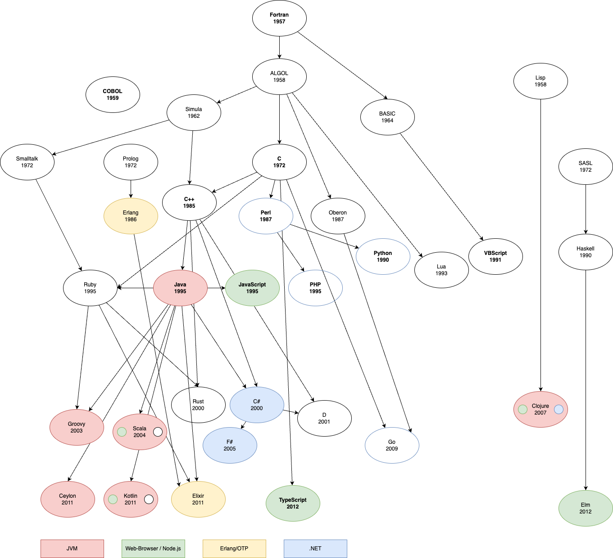

# dev-ecosystems

* [Language Samples](language-samples.org)

## Language Features

* Compiler, Interpreter, VMs
* Concurrency
* OO Features
* Functional Features
* [Meta Programming](meta-programming.org)
* Building DSLs
* Testing 
 * Unittests
 * Loadtests
 * Integrationtests
 * Benchmarks
* Debugging
* Protocols: TCP, HTTP, REST
* Frameworks: IOC, ORM, Web

## Katas

Katas are small programming exercises to practice language features and paradigms.

* [Fibonacci sequence](https://en.wikipedia.org/wiki/Fibonacci_sequence)
* [Roman Numerals](https://en.wikipedia.org/wiki/Roman_numerals)
* Parser
 * [s-expressions](https://en.wikipedia.org/wiki/S-expression)
 * [Markdown](https://en.wikipedia.org/wiki/Markdown)
* Graphical
 * [Conway's Game of Life](https://en.wikipedia.org/wiki/Conway%27s_Game_of_Life)
 * [Mandelbrot set](https://en.wikipedia.org/wiki/Mandelbrot_set)
* Concurrency
 * [Actor Framework](https://en.wikipedia.org/wiki/Actor_model)
